```mermaid
flowchart TD
    USER(["👤 User Interest\nTopic · Goal · Platforms"])

    PLANNER["🧠 Planner Agent \n Sets content goal\nGenerates search queries\nSelects target platforms\nOrchestrates workflow\n⛔ Never generates content"]

    SEARCH["🔍 Web Search Agent \n Fetches web pages + images\nReturns raw data only\n⛔ No summarization · No opinions"]

    RESEARCH["📚 Research Agent \n Reads raw data\nIdentifies factual statements\nRemoves noise & duplicates\nFilters by relevance"]

    CLAIMS[["🔗 Claim Structuring Agent \n Converts research → atomic claims\nExtracts numbers · entities · dates\nAttaches source references\nRejects unsupported statements\n★ ONLY output allowed to reach Writer"]]

    CREATOR["🎨 Content Creator Agent \n Decides format: thread / post / carousel\nOrders claims logically\nDesigns narrative flow\n⛔ No text writing"]

    WRITER["✍️ Writer Agent \n Converts claims → readable copy\nAdapts tone to platform\n⛔ No internet access\n⛔ No new facts · No inferences"]

    VERIFIER{"🛡️ Verifier Agent \n Compares draft vs claims\nDetects hallucinations\nDetects altered numbers/dates\nChecks logical consistency"}

    SAFETY["🔐 Safety Check \n Harmful guidance\nSensitive topics\nUnsafe advice\n⚡ Overrides ALL agents"]

    HUMAN(["👁 Human-in-Loop \n Triggered on ambiguity\nor medium confidence\nApprove or Reject only\n⛔ No rewriting"])

    STOP(["🚫 STOP\nPublishing blocked"])

    PUBLISHER["🚀 Publisher / Scheduler \n Formats per platform\nPublishes or schedules\nReturns status\n⛔ No reasoning · No modification"]

    LEARN["📈 Learnable Agent \n Observes performance metrics\nIdentifies successful patterns\nRecommends better strategies\n⛔ Never edits existing posts"]

    %% Main pipeline
    USER -->|"intent signal"| PLANNER
    PLANNER -->|"search queries"| SEARCH
    SEARCH -->|"raw external data"| RESEARCH
    RESEARCH -->|"clean knowledge"| CLAIMS
    CLAIMS -->|"sourced atomic claims"| CREATOR
    CREATOR -->|"content blueprint"| WRITER
    WRITER -->|"draft content"| VERIFIER

    %% Safety always runs alongside Verifier
    VERIFIER -.->|"always runs"| SAFETY

    %% Verifier outcomes
    VERIFIER -->|"✓ Verified"| PUBLISHER
    VERIFIER -->|"⚠ Needs Review"| HUMAN
    VERIFIER -->|"✗ Blocked"| STOP

    %% Human loop
    HUMAN -->|"approved"| PUBLISHER

    %% Publisher → Learnable → Planner feedback
    PUBLISHER -->|"performance metrics"| LEARN
    LEARN -->|"strategy insights"| PLANNER

    %% Styling
    classDef default fill:#fff,stroke:#333,stroke-width:1.5px,color:#111
    classDef controller fill:#fffde7,stroke:#f59e0b,stroke-width:2px,color:#111
    classDef tool fill:#eff6ff,stroke:#3b82f6,stroke-width:2px,color:#111
    classDef research fill:#f5f3ff,stroke:#7c3aed,stroke-width:2px,color:#111
    classDef truthgate fill:#fffbeb,stroke:#d97706,stroke-width:3px,color:#111
    classDef creator fill:#f0fdf4,stroke:#16a34a,stroke-width:2px,color:#111
    classDef writer fill:#ecfeff,stroke:#0891b2,stroke-width:2px,color:#111
    classDef guard fill:#fff1f2,stroke:#ef4444,stroke-width:2.5px,color:#111
    classDef safety fill:#fff1f2,stroke:#ef4444,stroke-width:2px,stroke-dasharray:5 3,color:#111
    classDef human fill:#fff7ed,stroke:#f97316,stroke-width:2px,color:#111
    classDef publisher fill:#f0fdf4,stroke:#16a34a,stroke-width:2px,color:#111
    classDef learnable fill:#faf5ff,stroke:#9333ea,stroke-width:2px,color:#111
    classDef stop fill:#fee2e2,stroke:#ef4444,stroke-width:2px,color:#991b1b

    class USER human
    class PLANNER controller
    class SEARCH tool
    class RESEARCH research
    class CLAIMS truthgate
    class CREATOR creator
    class WRITER writer
    class VERIFIER guard
    class SAFETY safety
    class HUMAN human
    class STOP stop
    class PUBLISHER publisher
    class LEARN learnable
```

# TrustPostAI — System Architecture
> Credibility-first multi-agent publishing pipeline

**Information Flow Rule:**
`Raw Data → Structured Facts → Content Structure → Writing → Verification → Publish`

---

---

## Strict System Rules

| # | Rule |
|---|------|
| R1 | Writer **cannot** access the internet |
| R2 | Writer **cannot** access research directly |
| R3 | Only structured claims may reach the Writer |
| R4 | Verification is **mandatory** before publishing |
| R5 | Verification failure → publishing stops immediately |
| R6 | Safety checks **override** all other agents |

---

## Agent Summary

| Agent | Role | Key Constraint |
|-------|------|----------------|
| 🧠 Planner | Orchestrator | Never generates content |
| 🔍 Web Search | Data collection | Raw data only, no interpretation |
| 📚 Research | Knowledge extraction | No final claims |
| 🔗 Claim Structuring | Truth boundary | Sole source for Writer |
| 🎨 Content Creator | Structure design | No text writing |
| ✍️ Writer | Language generation | Claims only, no internet |
| 🛡️ Verifier | Trust enforcement | Blocks or approves |
| 🔐 Safety Check | Content safety | Overrides everything |
| 👁 Human-in-Loop | Ambiguity resolver | Approve/reject only |
| 🚀 Publisher | Execution | No reasoning allowed |
| 📈 Learnable | Feedback loop | Never edits posts |